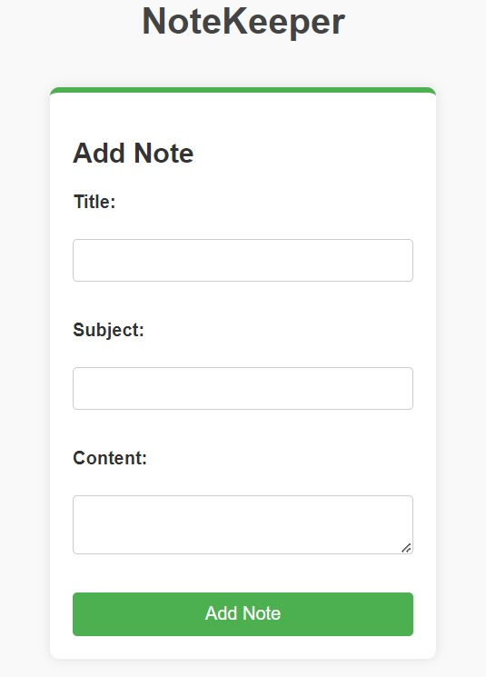
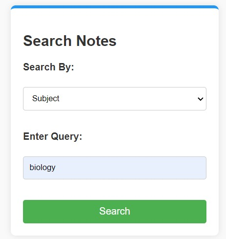

# 📝 NoteKeeper Application

## 📖 Overview

The NoteKeeper application is a web-based tool designed for managing personal notes. Users can add, store, and search for notes efficiently. With a user-friendly interface and dynamic search features, NoteKeeper makes it easy to keep track of important information.

## 🚀 Features

- **Add Notes:** Create notes with a title, subject, content, and creation date.
- **Search Notes:** Find notes by date, title, subject, or content.

## 🛠 Technologies Used

- **Frontend:** HTML, CSS, JavaScript
- **Backend:** JSP
- **Database:** MySQL
- **Server:** Apache Tomcat

## 📦 Installation

### Prerequisites

1. **Java Development Kit (JDK):** Ensure JDK is installed.
2. **MySQL:** Install and set up MySQL server.
3. **Apache Tomcat:** Install Apache Tomcat for JSP support.

### Setting Up the Database

1. Create a database named `notekeeper` in MySQL.
2. Run the following SQL script to create the `notes` table:

    ```sql
    CREATE TABLE notes (
        id INT AUTO_INCREMENT PRIMARY KEY,
        title VARCHAR(255) NOT NULL,
        subject VARCHAR(255) NOT NULL,
        content TEXT NOT NULL,
        created_at TIMESTAMP DEFAULT CURRENT_TIMESTAMP
    );
    ```

### Configuring the Application

1. **Clone the Repository:**

    ```bash
    git clone https://github.com/ShenbagaPriya6/notekeeper.git
    ```

2. **Set Up Your Database Connection:**

    Open JSP files (`fetchNotes.jsp`, `addNotes.jsp`, `searchNotes.jsp`) and update the database credentials:

    ```java
    Class.forName("com.mysql.cj.jdbc.Driver");
    connection = DriverManager.getConnection("jdbc:mysql://localhost:3306/notekeeper", "root", "password");
    ```

3. **Deploy the Application:**

    - Copy project files to the `webapps` directory of Apache Tomcat.
    - Start Apache Tomcat.

## 📖 Usage

### Adding a Note

1. **Navigate to Add Note Page:**

    

2. **Fill in the Form:**

    - Enter the title, subject, and content.
    - Select the date.
    - Click "Add Note."

### Searching for Notes

1. **Navigate to Search Notes Page:**

    
 


3. **Select Search Criteria:**

    - Choose search criteria (date, title, subject, or content).
    - Enter the search query.
    - Click "Search."


## 💻 File Structure

- `index.jsp`: Home page
- `addNote.jsp`: Add new notes
- `searchNotes.jsp`: Search notes
- `quickSearchNotes.jsp`: Quick search functionality
- `fetchNotes.jsp`: Fetch all notes
- `style.css`: Styling for the application
- `script.js`: JavaScript for dynamic behavior
